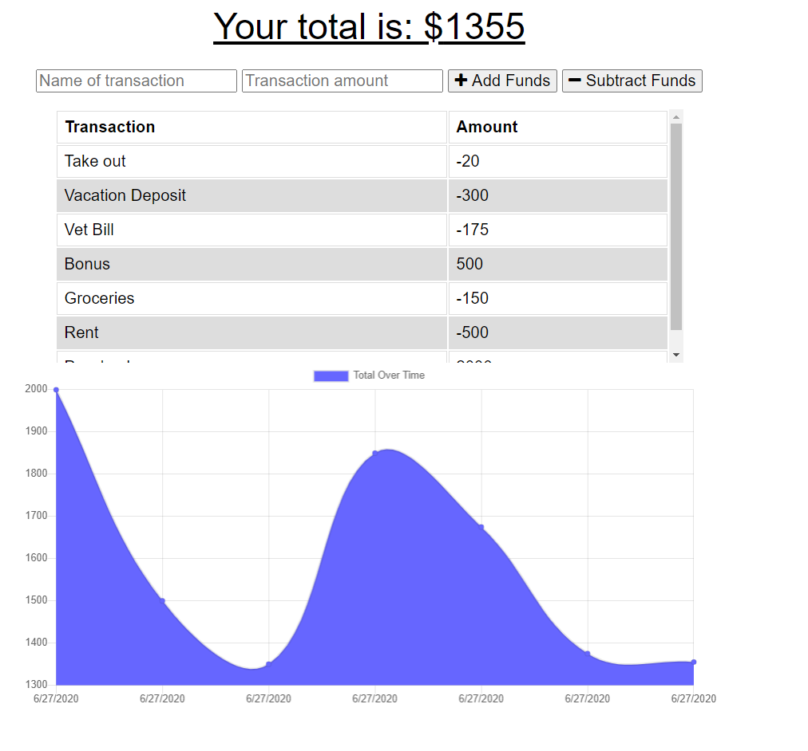

# Welcome to The Budget Tracker by Joy Chen

[](https://shields.io/) [](https://shields.io/) 

[](https://shields.io/) [](https://shields.io/) 
  
## Description
  
This application will assist you in keeping track of your expenses when you have internet and when you don't! The offline feature is extremely helpful for when users are in areas where the internet is sparse or super expensive and just not worth connecting to. This budget application will store your transactions offline until you get an opportunity to connect to the internet. None of the your transactions will be lost again! This progressive web application utilizes JavaScript, Express, and MongoDB to provide a friendly budget app.

<div align="center"></div>

## User Story

As a world traveler, I want to use this application to keep track of my transactions online and offline, so that I can continuously keep track of my budget.
  
## Table of Contents
* [Installation](#installation)
* [Usage](#usage)
* [Demo](#demo)
* [Questions](#questions)

  
## Installation

To use this application, run the following commands in your terminal to install the appropriate packages
```
    npm install
```

## Usage 

After you've installed the packages, to run the application, just navigate to the deployed site at https://online-offline-budget.herokuapp.com/ or they can navigate to the github repository and run the code there using 
```
    npm run start
```


## Demo
<div align="center"></div>

## Questions
  
If you see any improvements that can be made, please email me at joychen5069@gmail.com. You can also visit my GitHub page at https://github.com/joychen5069 or visit the Workout Tracker page at https://github.com/joychen5069/OnlineOfflineBudgetTracker

  